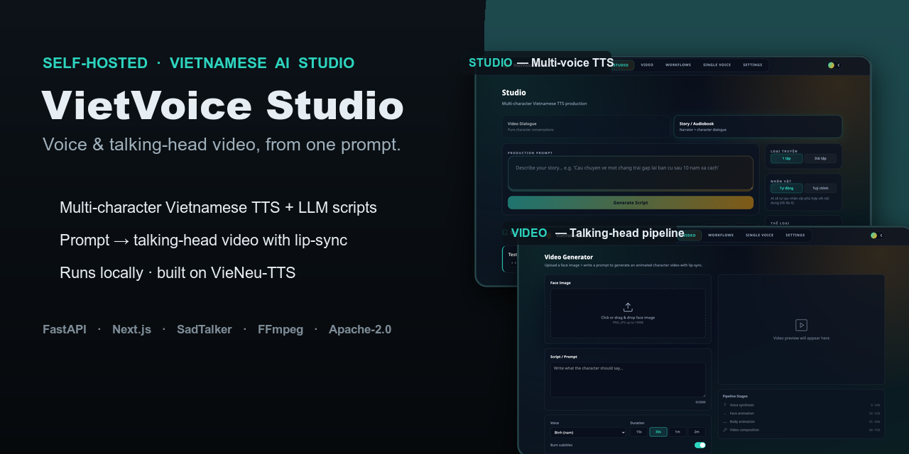

# VietVoice Studio

<p align="center">
  
</p>

<p align="center">
  <em>Two jobs, one app: a multi-character Vietnamese <strong>TTS Studio</strong>, and a <strong>Video Generator</strong> that turns a face image + prompt into a lip-synced talking-head video.</em>
</p>

**Self-hosted studio for producing Vietnamese voice & talking-character video — from a single prompt.**

VietVoice Studio turns a text prompt or script into multi-character Vietnamese audio, and can drive a full **prompt → talking-head video** pipeline that runs entirely on your own machine. It is built on top of the open-source [VieNeu-TTS](https://github.com/pnnbao97/VieNeu-TTS) speech engine.

> ⚠️ Vietnamese-first. The TTS engine, voices and text normalization are tuned for Vietnamese.

---

## What it does

🎙️ **Multi-character TTS** — generate dialogue / audiobook audio with automatic voice assignment per character.
📝 **LLM script generation** — describe a scene, get a structured multi-character script (Claude / OpenAI).
🧬 **Zero-shot voice cloning** — clone a voice from a few seconds of reference audio.
🎬 **Talking-head video pipeline** — prompt + face image → MP4 of a character speaking (LLM script → voice → face animation → body animation → composition).
🖥️ **Web UI** — Next.js front-end (Studio / Video / Workflows / Single Voice / Settings).
💻 **Runs locally** — CPU (GGUF quantized) or GPU; no third-party media APIs required (only an LLM for script generation).

---

## Architecture at a glance

```
                         ┌──────────────────────────────┐
   Browser  ───────────► │  FastAPI backend (port 8001) │
   (Next.js UI)          │  apps/studio_api.py          │
                         │  + serves built front-end    │
                         └───────────────┬──────────────┘
                                         │
                 ┌───────────────────────┼───────────────────────┐
                 ▼                       ▼                       ▼
        ┌─────────────────┐   ┌────────────────────┐   ┌──────────────────┐
        │ LLM script gen  │   │  Multi-char TTS    │   │ Video pipeline   │
        │ (Claude/OpenAI) │   │  StudioProducer    │   │ apps/video/      │
        └─────────────────┘   └─────────┬──────────┘   └────────┬─────────┘
                                        │                       │
                                        ▼                       ▼
                            ┌───────────────────────────────────────────┐
                            │  VieNeu-TTS engine (vendored, Apache-2.0)  │
                            │  src/vieneu/  +  NeuCodec  +  sea-g2p       │
                            └───────────────────────────────────────────┘

   Video pipeline stages:  LLM script → VieNeu-TTS voice → SadTalker face
                           → Three.js body → FFmpeg compose → final .mp4
```

Detailed docs: [`docs/system-architecture.md`](docs/system-architecture.md) · [`docs/video-pipeline-architecture.md`](docs/video-pipeline-architecture.md).

---

## Quick start

### Requirements
- Python 3.10+ and [`uv`](https://github.com/astral-sh/uv)
- Node.js 18+ (for the front-end)
- FFmpeg (for the video pipeline)
- ~16 GB RAM; GPU optional (CPU inference uses GGUF quantized models)

### Install & run

```bash
git clone <your-repo-url> vietvoice-studio
cd vietvoice-studio

# One-shot: sets up Python env, builds the front-end, serves on :8001
./start.sh
# → open http://localhost:8001
```

### Development (hot-reload)

```bash
# Terminal 1 — backend (API + TTS + video pipeline)
uv run python -m apps.studio_api          # http://localhost:8001

# Terminal 2 — front-end with hot reload
cd client && npm install && npm run dev    # http://localhost:3000
```

The front-end calls the API at `http://localhost:8001` by default (override via `NEXT_PUBLIC_API_URL`).

### Configuration

- **Models / device / port / voices** → `config.yaml` (`studio.*`).
- **LLM provider** → `config.yaml` (`studio.llm.provider`) or env `STUDIO_LLM_PROVIDER` (`claude` / `openai`). Set `ANTHROPIC_API_KEY` / `OPENAI_API_KEY` in `.env` when using SDK providers (see `.env.example`).
- Models download from Hugging Face on first run; output is written to `output/studio/`.

---

## API (mounted under `/studio`)

| Endpoint | Method | Purpose |
|---|---|---|
| `/studio/generate-script` | POST | LLM script generation from a prompt |
| `/studio/produce` | POST | Multi-character TTS production |
| `/studio/pipeline` | POST | Auto voice assignment + produce |
| `/studio/clone-voice` | POST | Zero-shot voice cloning |
| `/studio/voices` | GET | List available voices |
| `/studio/job-status/{id}` | GET | Job progress |
| `/studio/download/{id}` | GET | Download result |
| `/studio/progress/{id}` | WS | Real-time progress |
| `/studio/video/*` | POST/GET/WS | Talking-head video generation |

---

## Project layout

```
apps/
  studio_api.py        FastAPI app: TTS production, LLM scripts, jobs, serves FE
  video/               Video pipeline (face / body / voice / composer + API)
client/                Next.js front-end (static export served by the backend)
src/vieneu/            Vendored VieNeu-TTS engine (Apache-2.0)  — do not modify lightly
src/vieneu_utils/      Text chunking + Vietnamese phonemization
config.yaml            Models, devices, port, voices, LLM provider
docs/                  Architecture & standards
```

---

## Credits

This project is built on **[VieNeu-TTS](https://github.com/pnnbao97/VieNeu-TTS)** by **Phạm Nguyễn Ngọc Bảo** — the Vietnamese TTS engine, the preset voices, and the model weights (`pnnbao-ump/VieNeu-TTS*` on Hugging Face) are their work, used under the Apache License 2.0.

Other components: [SadTalker](https://github.com/OpenTalker/SadTalker) (face animation), [NeuCodec](https://huggingface.co/neuphonic) (audio codec), [sea-g2p](https://pypi.org/project/sea-g2p/) (Vietnamese phonemization), [Three.js](https://threejs.org/) (body animation), FFmpeg (composition).

See [`NOTICE`](NOTICE) for full attribution.

---

## License

Licensed under the **Apache License 2.0** — see [`LICENSE`](LICENSE) and [`NOTICE`](NOTICE).
